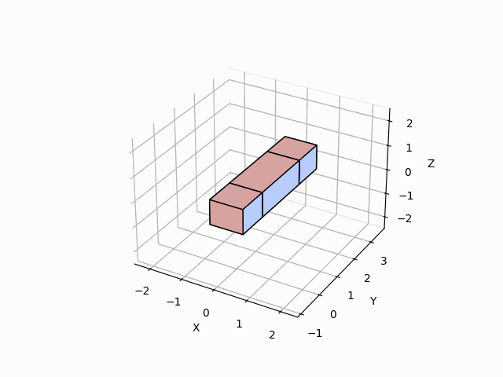

# Topologiq: Algorithmic Lattice Surgery
A family of algorithms (ok, there's currently *one* full algorithm, but it is a foundation to make a family of them) to convert ZX circuits into logical versions of themselves.

It is based on the surface code and lattice surgery and produces topologically correct space-time diagrams (logical computations) like the one below (see `./assets/media` for additional examples).



*Figure 1. Example output (Stene code).*

***Note.*** This is work in progress.

## Background
ZX-calculus<sup>[1-7]</sup> is a helpful and intuitive way to represent and manipulate design quantum circuits. Virtues notwithstanding, ZX-circuits/graphs are not immediately amicable to quantum error correction (QEC). Barring unexpected developments on the hardware front, there is a need to convert them into logical computations resilient to errors.

A leading approach to building logical quantum computations that are seemingly resilient to errors is the surface code,<sup>[8-14]</sup> a planar entanglement of qubit operations that join many qubits into a single logical computation. Lattice surgery<sup>[15-23]</sup> is the process of merging and splitting surface code patches to create continuous logical computations, often visualised as space-time diagrams like Figure 1.

Researchers have found a number of basic "primitive" lattice surgery operations that can be combined to form logical computations.<sup>[18-20, 24-27]</sup> The blocks have been validated as valid instances of surface code operations in an ongoing open-source effort to develop “automation software for representing, constructing and compiling large-scale fault-tolerant quantum computations based on surface code and lattice surgery”.<sup>[28]</sup>

When you name these "primitives" by reference to both the underlying topological features of the surface code *and* the coordinate space, the names become "symbolic" in a very mathematical sense:
- The names can be manipulated using symbolic operations
- The names can be used to establish potential placements for linked operations
- The names can be used to ensure the outcome of a lattice surgery is topologically correct.

The algorithms in this repository use the topological properties of these "primitives" to traverse a ZX graph, place its nodes in a 3D space, and devise the operations needed to deliver a topologically-correct space-time diagram.

## Install
The goal is to enable usage as a dependency.

Meanwhile, the best way to install is to clone the repository, recreate the environment, and install all dependencies.

Clone. 
```
git clone https://github.com/jbolns/topologiq.git
```

Recreate environment.
```
# In the root of the repository.

## GNU/Linux and MacOS
python -m venv .venv
source .venv/bin/activate

## Windows
### CMD
python -m venv .venv
.venv\Scripts\activate.bat
### PowerShell
python -m venv .venv
.venv\Scripts\Activate.ps1
```

Install dependencies.
```
pip install -r requirements.txt
```

## Examples
For examples, run any of the commands below from the root of the repository. The algorithm will run and stop when it finds a succesfull solution or run up to ten times. 

A succesfull result will produce:
- a 3D interactive graph (pops up)
- a GIF animation of the process (saves to `./outputs/media/`)
- a TXT file with information about the initial ZX graph, intermediate state, and final result (saves to `./outputs/txt/`)
  - All information printed to this TXT file is also available for programmatic use.

All examples except the random circuit have been validated manually: check the [validation folder](./assets/validation/) for summary documents.

``` bash
# A CNOT, using PyZX.
python -m run --pyzx:cnot

# Random series of CNOTs, using PyZX: CNOT_HAD_PHASE_circuit().
# Ps. This one is not actually validated. I just realised I changed the circuit after validating a different combination of CNOTs. Will change back soon.
python -m run --pyzx:cnots

# A medium-size circuit with three interconnected lines.
python -m run --pyzx:simple_mess

# Line of hadamards
python -m run --graph:hadamard_line

# Circuit with Hadamards on bends
python -m run --graph:hadamard_bend

# A 7-qubit Steane code, from a non-descript graph. 
# Ps. This is a tightly-packed circuit with several interconnected nodes, so a few rounds might be needed for success.
python -m run --graph:steane

# A mess of hadamards
# Ps. This is a tightly-packed circuit with several interconnected nodes and a few Hadamards, so a few rounds might be needed for success.
python -m run --graph:hadamards_mess

# Random circuit, optimised, using PyZX: zx.generate.cliffordT(), zx.simplify.phase_free_simp().
# Ps. Check the randomly generated graph to ensure all qubit lines are interconnected. See "process" section above for details.
python -m run --pyzx:random

```

There are also several visualisation options that can be appended to any command.

``` bash

# "BOUNDARIES" considered and visualised.
python -m run --pyzx:cnot

# "BOUNDARIES" considered by algorithm but NOT visible in visualisations.
python -m run --pyzx:cnot --hide_boundaries

# "BOUNDARIES" stripped prior performing any operations.
python -m run --pyzx:cnot --strip_boundaries

```

There are also additional options that can be appended to any command.

``` bash
# Run the Steane code example and log stats for every attempt
python -m run --graph:steane --log_stats

# Run the Steane code example 1 times only irrespective of outcome
python -m run --graph:steane --repeat:1

# Run the Steane code example 50 times and log stats for all 50 cycles
python -m run --graph:steane --log_stats --repeat:50

```

## Use your own circuits
It would be great to hear of tests using other circuits.
- You can use a non-descript ZX graph defined as a dictionary of nodes and edges. See `assets/graphs/simple_graphs.py` for examples.
- You can also use a PyZX graph. See check `run.py` for a blueprint of the process needed and `assets/graphs/pyzx_graphs.py` for examples of graphs.

Please note, however, that the algorithm is not expected to always succeed. The current goal is to inform developmental priorities by identifying types of circuits for which the current implementation performs good, less good, bad, and awfully.

## Yeah, but how does it work, really?
A detailed insight into the algorithm and, hopefully, a paper, is in progress. Meanwhile, below, a quick overview of the inner workings of the algorithm. 

**In first place,** the algorithm will look for an incoming ZX graph and, if needed and possible, convert it into a native format.
- ***Native format:*** A simple dictionary of nodes and edges (see `assets/graphs/simple_graphs.py` for examples).
- ***PyZX interoperability:*** PyZX graphs supported (check `run.py` for a blueprint of the conversion process and `assets/graphs/pyzx_graphs.py` for examples).
  - Note. If using a random PyZX circuit for testing, ensure all qubit lines are interconnected. If a qubit line is not interconnected, the graph has subgraphs. The algorithm treats subgraphs as separate logical computations, and will focus on one subgraph only.

**After,** the algorithm will traverse the ZX graph transforming each node into an equivalent "primitive" and position it in a way that honours the original graph. This second part of the process is itself divided into several stages:
- ***Positioning:*** organises the process of placing each node into a number of tentative positions.
  - Step currently follows a greedy Breadth First Search (BFS) approach.
  - Additional strategies will be explored in due course. 
- ***Pathfinding:*** explores a 4D space (x, y, z, block type) to determine which tentative positions allow topologically-correct paths.
  - Step currently uses a slightly-modified Dijkstra.
  - Additional strategies may be explored in due course mainly because Dijkstra is an inherently-slow algorithm.
  - That said, the priority is to optimise the existing approach to ensure maximal robustness.
- ***Value function:*** Chooses best path from the pathfinding algorithm based on given hyperparameters attached to the positioning algorithm.
  - Hyperparameters currently set to values that increase the odds of finding a successful solution in test runs. 
  - This does **NOT** mean the algorithm will produce optimal results with current hyperparameters.
  - An automated approach to discovering optimal hyperparameters will eventually be added, but this is not currently available.
  - To vary hyperparameters manually, edit `run_hyper_params.py`.

## Pending
Everything is pending, but below a list of highest priorities:
- Add health checks to outcomes to avoid undetected errors.
- Improve PyZX support.
- Add better documentation.
- Add detailed example sheets.
- Enable automatic selection and variation of hyperparameters.
- Improve run-times.

## License
This repository is open source software. All code in the repository is under an Apache 2.0 license.

## References
1. Coecke, B. & Duncan, R. Interacting Quantum Observables. In *Automata, Languages and Programming* (eds. Aceto, L. et al.) 298–310 (Springer, Berlin, Heidelberg, 2008).  
2. Duncan, R. & Perdrix, S. Graph States and the Necessity of Euler Decomposition. In *Mathematical Theory and Computational Practice* (eds. Ambos-Spies, K., Löwe, B. & Merkle, W.) 167–177 (Springer, Berlin, Heidelberg, 2009).  
3. Coecke, B. & Duncan, R. Interacting quantum observables: categorical algebra and diagrammatics. *New J. Phys*. 13, 043016 (2011).  
4. Backens, M. The ZX-calculus is complete for stabilizer quantum mechanics. *New J. Phys*. 16, 093021 (2014).  
5. Backens, M. Making the stabilizer ZX-calculus complete for scalars. *Electron. Proc. Theor. Comput. Sci*. 195, 17–32 (2015).  
6. Wetering, J. van de. ZX-calculus for the working quantum computer scientist. PrePrint (2020).  
7. Kissinger, A. & Wetering, J. van de. Universal MBQC with generalised parity-phase interactions and Pauli measurements. *Quantum* 3, 134 (2019).  
8. Kitaev, A. Yu. Quantum Error Correction with Imperfect Gates. In *Quantum Communication, Computing, and Measurement* (eds. Hirota, O., Holevo, A. S. & Caves, C. M.) 181–188 (Springer US, Boston, MA, 1997).  
9. Kitaev, A. Y. Fault-tolerant quantum computation by anyons. *Ann. Phys*. 303, 2–30 (2003).  
10. Bravyi, S. B. & Kitaev, A. Y. Quantum codes on a lattice with boundary. Preprint (1998).  
11. Dennis, E., Kitaev, A., Landahl, A. & Preskill, J. Topological quantum memory. *J. Math. Phys*. 43, 4452–4505 (2002).  
12. Fowler, A. G., Stephens, A. M. & Groszkowski, P. High threshold universal quantum computation on the surface code. *Phys. Rev*. A 80, 052312 (2009).  
13. Fowler, A. G., Mariantoni, M., Martinis, J. M. & Cleland, A. N. Surface codes: Towards practical large-scale quantum computation. *Phys. Rev*. A 86, 032324 (2012).  
14. Acharya, R. et al. Quantum error correction below the surface code threshold. *Nature* 638, 920–926 (2025).  
15. Horsman, D., Fowler, A. G., Devitt, S. & Meter, R. V. Surface code quantum computing by lattice surgery. *New J. Phys*. 14, 123011 (2012).  
16. Litinski, D. & Oppen, F. von. Lattice Surgery with a Twist: Simplifying Clifford Gates of Surface Codes. *Quantum* 2, 62 (2018).  
17. Landahl, A. J. & Ryan-Anderson, C. Quantum computing by color-code lattice surgery. Preprint (2014).  
18. Fowler, A. G. & Gidney, C. Low overhead quantum computation using lattice surgery. Preprint (2019).  
19. Gidney, C. & Fowler, A. G. Efficient magic state factories with a catalyzed |CCZ〉-> |T〉transformation. *Quantum* 3, 135 (2019).  
20. Gidney, C. & Fowler, A. G. Flexible layout of surface code computations using AutoCCZ states. Preprint (2019).  
21. Tan, D. B., Niu, M. Y. & Gidney, C. A SAT Scalpel for Lattice Surgery: Representation and Synthesis of Subroutines for Surface-Code Fault-Tolerant Quantum Computing. In *2024 ACM/IEEE 51st Annual International Symposium on Computer Architecture (ISCA)* 325–339 (2024).  
22. Shaw, A. T. E., Bremner, M. J., Paler, A., Herr, D. & Devitt, S. J. Quantum computation on a 19-qubit wide 2d nearest neighbour qubit array. Preprint (2022).  
23. Gehér, G. P., McLauchlan, C., Campbell, E. T., Moylett, A. E. & Crawford, O. Error-corrected Hadamard gate simulated at the circuit level. *Quantum* 8, 1394 (2024).  
24. Paetznick, A. & Fowler, A. G. Quantum circuit optimization by topological compaction in the surface code. Preprint (2013).  
25. Paler, A., Devitt, S. J. & Fowler, A. G. Synthesis of Arbitrary Quantum Circuits to Topological Assembly. *Sci. Rep*. 6, 30600 (2016).  
26. Fowler, A. G. Computing with fewer qubits: Pitfalls and tools to keep you safe [Conference Presentation]. *Munich Quantum Software Forum* (2023).  
27. Fowler, A. G. Programming a quantum computer using SketchUp [Conference Presentation]. *Munich Quantum Software Forum* (2024). 
28. TQEC Community. TQEC (Topological Quantum Error Correction): Design Automation Software Tools for Topological Quantum Error Correction. https://github.com/tqec/tqec (2025).