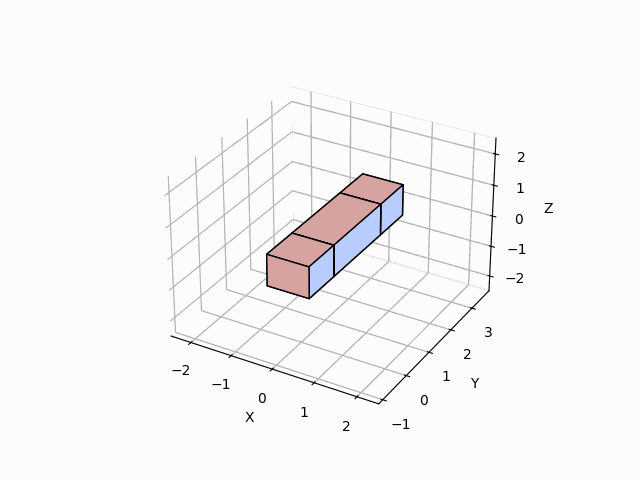

# Algorithmic lattice surgery
The code in this repository was used to build the following lattice surgery. The general idea is to take a raw ZX graph and convert it into an error-corrected 3D version of itself.

***Note.*** This is work in progress.

## GIF

Img 1. GIF animation of the process to build a 7 qubit steane code