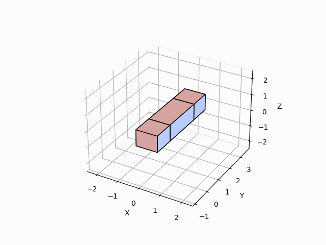

# Algorithmic Lattice Surgery
A family of algorithms (ok, there's currently *one* full algorithm, but it is a foundation to make a family of them) to convert ZX circuits into logical versions of themselves.

***Note.*** This is work in progress.

***Note.*** A better README is on the way.

## Example
To run an example, run the following command from the root of the repository to run the algorithm for a 7-qubit Steane code. The algorithm will stop when it finds a succesfull solution (most times), or run up to ten times (sometimes).

```
python -m run --steane
```

A succesfull result will produce a GIF animation like the one below (saved to `.assets/outputs/gif/`) and a dictionary of edges containing the different blocks needed to build the logical computation.

   
*Figure 1. GIF animation of the process to build a Steane code (example run).*

***Note.*** Currently, hyper-parameters are set to values that more or less increase the odds of finding a successful solution in a test run using Steane and in a reasonable amount of time (in tests carried out locally, 5 min in average, with super lucky runs taking less than a minute). To vary hyper-parameters manually, edit `run_hyper_params.py`, which will enable results of varied quality and significant variation in run-times. There is, currently, no automatic method of varying or smartly-determining hyper-parameters.

## Pending
Everything is pending, but below a list of highest priorities:
- Continue to improve the runner function in `run.py` to enable automatic selection and variation of hyper-parameters.
- Continue to improve run-times.
- Add support for PyZX circuits.
- Add support for circuits with Hadamards.
