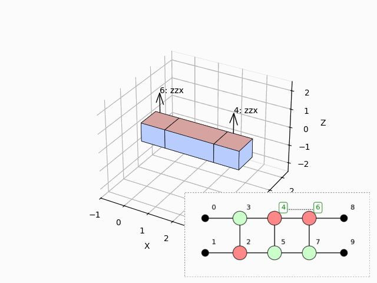
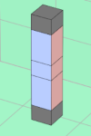
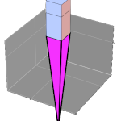
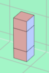
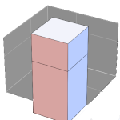
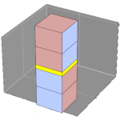
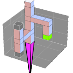
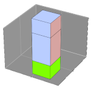
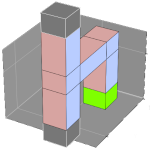

# Topologiq: Algorithmic Lattice Surgery
**Topologiq** is tool to convert ZX circuits into logical versions of themselves. It is based on the surface code and lattice surgery.

[](https://unitary.foundation)

## ✨ Overview
Topologiq is a greedy BFS algorithm that attempts to minimise the volume of the final build, which we call BlockGraph but is also often referred to as space-time or pipe diagram.

The general algorithmic rationale is as follows:
- Topologiq traverses the input circuit graph using a BFS rationale, one edge at a time.
- On each iteration, it greedily converts the edge into the shortest topologically-correct 3D path it can find.
  - Realised paths often correspond to the actual shortest path possible.
  - Where not the case, it is typically because a shortest path is deemed an unavoidable obstacle for future placements.

An animated visualisation is given below, and the algorithm is described [here](docs/concepts/topologiq_algorithm.md).



*Figure 1. Algorithmic lattice surgery of three CNOTs using Topologiq.*

## 🔗 Gate support
Topologiq supports the following gate set and combinations thereof:

> NB! The block patterns in the images below are **NOT hard patterns**. Topologiq yields the patterns in the images if there are no other gates in the circuit. However, the patterns are flexible and will be bent and stretched in all sort of manners during the lattice surgery. That is, *literally*, what Topologiq does. It bends new patterns around old patterns in ways that do not break the topology of the computation.

| CLIFFORD | | NON-CLIFFORD | |
| -------- | ------------ | ------------ | ------------ |
| **X, Z, I:** |  | **Cultivation:** |  |
| **CNOT, CZ:** |  | **Conditional:** |   |
| **Hadamard:** |  | **T:** |  |
| **Y:** |  |  |  |
| **S:** |  |  |  |

## 🏛️ Architecture
Topologiq is designed to be (or at the very least, become) highly modular. The final goal is to allow others to easily use tailored component and/or develop end-to-end "flavours" re-interpreting several components. 

An overview of Topologiq's general architecture is available [here](docs/concepts/architecture.md).

> Currently, an area where contributors could make a massive difference in the short term is CI/CD workflows for testing and benchmarking. Leaving these "for later" helped in that it enabled rapid experimentation and iteration. However, the codebase is becoming a bit too large to keep it like that.  [Open an issue to contribute a CI/CD](https://github.com/tqec/topologiq/issues/new/choose).

## 🛠 Install
Currently, the best way to test **Topologiq** is to clone the repository, recreate the environment, and install dependencies.

### Using UV
```bash
# 1. Clone repository. 
git clone https://github.com/jbolns/topologiq.git

# 2. Sync environment.
uv sync  # Topologiq
# or
uv sync --group integration  # Topologiq w. TQEC/tqec

# Additional steps needed only for contributors
# 3. Opt for an editable installation
uv sync --group all
uv pip install -e .
```

### Using PIP
```bash
# 1. Clone repository. 
git clone https://github.com/jbolns/topologiq.git

# 2. Recreate environment.
# 2.1. Environment creation
python -m venv .venv

# 2.2. Environment activation
.venv\Scripts\activate.bat  # Windows
source .venv/bin/activate  # Linux

# 2.3. Install dependencies
pip install -r requirements.txt

# Additional steps needed only for contributors
# 3. Opt for an editable installation
pip install -e .
```

## 🚀 Documentation
There is a growing number of examples showing how to use Topologiq in a variety of circumstances.

### Beginner
Examples of how to use Topologiq with circuits designed in a number of frameworks compatible with Topologiq:
- [Using ***PyZX*** circuits in Topologiq (CNOTs, small)](docs/examples/pyzx_cnots.ipynb).[^1]
- [How to use Topologiq with ***QASM*** files (CNOTs, multiple)](docs/examples/qasm_panel.py).
- [How to use with a ***Qiskit*** circuit (GHZ)](docs/examples/qiskit_ghz.py).
- [Using ***Qrisp*** circuits with Topologiq (H-Z-S-T)](docs/examples/qrisp_combo.ipynb).[^1]
- $\textcolor{red}{\textsf{[Pending]}}$ Other qBraid supported formats: [Open an issue to contribute an example](https://github.com/tqec/topologiq/issues/new/choose).
- $\textcolor{red}{\textsf{[Pending]}}$ Other circuit design framework able to output QASM: [Open an issue to contribute an example](https://github.com/tqec/topologiq/issues/new/choose).

### Intermediate
Examples using Topologiq programmatically and with human-readable output files in [BGRAPH](src/topologiq/assets/cnots.bgraph) format.
- [Verifiable lattice surgery with *PyZX* and Topologiq (Steane)](docs/examples/steane_verified.ipynb).[^1]
- [Using Topologiq with random PyZX graphs and producing a ***BGRAPH file as primary output*** (Clifford & non-Clifford)](docs/examples/pyzx_random.py).

### Advanced
Examples of how to use Topologiq with [TQEC/tqec](https://github.com/tqec/tqec).
- $\textcolor{red}{\textsf{[Pending]}}$ Using Topologiq and TQEC as part of a shared environment: [Open an issue to contribute an example](https://github.com/tqec/topologiq/issues/new/choose).
- $\textcolor{red}{\textsf{[Pending]}}$ Using Topologiq from within a TQEC environment: [Open an issue to contribute an example](https://github.com/tqec/topologiq/issues/new/choose).

## 👷🏽‍♂️ Contributing
Pull requests and issues are more than welcomed!

See [CONTRIBUTING](./CONTRIBUTING.md) for specific instructions to start contributing.

## 📜 License
Topologiq is licensed under an [Apache 2.0 license](./LICENSE).

The [`ETHICAL_NOTICE.md`](ETHICAL_NOTICE.md) contains additional **ethical use** pointers.

## 🏟️ Community
Every Wednesday at 8:30am PST, we hold [meetings](https://meet.jit.si/TQEC-design-automation) to discuss project progress and conduct educational talks related to TQEC.

Here are some helpful links to learn more about the TQEC community and Topologiq:
- Overview of state of the art 2D QEC: [Slides](https://docs.google.com/presentation/d/1xYBfkVMpA1YEVhpgTZpKvY8zeOO1VyHmRWvx_kDJEU8/edit?usp=sharing)/[Video](https://www.youtube.com/watch?v=aUtH7wdwBAM&t=2s)
- Introduction to surface code quantum computation: [Slides](https://docs.google.com/presentation/d/1GxGD9kzDYJA6X47BXGII2qjDVVoub5BsSVrGHRZINO4/edit?usp=sharing)
- Programming a quantum computer using SketchUp: [Slides](https://docs.google.com/presentation/d/1MjFuODipnmF-jDstEnQrqbsOtbSKZyPsuTOMo8wpSJc/edit?usp=sharing)/[Video](https://drive.google.com/file/d/1o1LMiidtYDcVoEFZXsJPb7XdTkZ83VFX/view?usp=drive_link)
- Overview of Topologiq: [Video](https://drive.google.com/file/d/1C9Kke4qSYd0lX5qO_yvUX88DsPt8kyaP/view?usp=drive_link)
- Qiskit->QASM->Topologiq interoperability: [Video](https://drive.google.com/file/d/1tFYNmvvyNDT04BK6U3ESRZVXB1PrObGd/view).

All the resources and group meeting recordings are available at [this link](https://docs.google.com/spreadsheets/d/11DSA2wzKLOrfTGNHunFvzsMYeO7jZ8Ny8kpzoC_wKQg/edit?usp=sharing&resourcekey=0-PdGFkp5s-4XWihMSxk0UIg).

Please join the [Google group](https://groups.google.com/g/tqec-design-automation) to receive more updates and information!


<br />
<br />
<br />

[^1]: Documents currently demonstrate basic usage but could be improved and expanded. [Open an issue to improve or expand](https://github.com/tqec/topologiq/issues/new/choose).