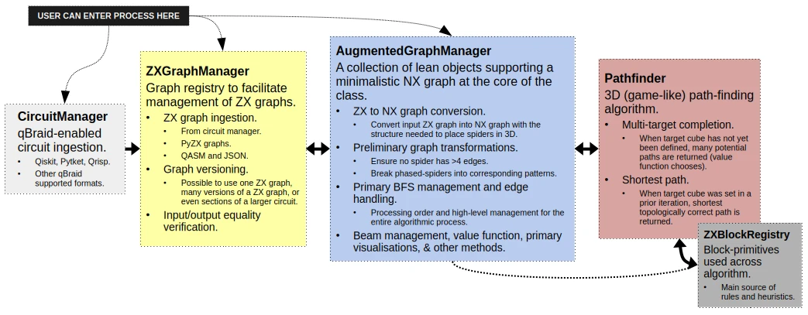

# Topologiq: General architecture

## Executive summary
Topologiq is designed with modularity in mind. The final goal is to allow others to easily use tailored component and/or develop end-to-end "flavours" re-interpreting several components. The codebase is not quite there yet, but core components are already fairly modular and the main need at the moment is guidelines, classes and/or protocols to facilitate tailored implementations.

## Workflow
The figure below summarises the general workflow and architecture of Topologiq.



*Figure 1. Overview of Topologiq's architecture.*

Key points worth highlighting, along their implications:
- The user can enter the process at any point prior to running the algorithm.
  - It is possible to design a highly-tailored user experience (e.g. AI workflows) by simply choosing entry point wisely.
- The algorithm is, itself, subdivided into subroutines.
  - It is possible to mix some of the algorithms currently in Topologiq with tailored subroutines.
- The vast majority of geometric constraints and heuristics are concentrated in the ZXBlockManager.
  - It is possible to fundamentally change Topologiq by simply altering the blocks it uses.

## Folder structure
The structure of the codebase matches the general rationale in the figure above.

```text

.
├── benchmark
│   │   └── ... # Folder not yet in use. Contributions welcome!
├── docs
│   ├── concepts
│   │   └── ... # Documents detailing important aspects of Topologiq.
│   ├── examples
│   │   └── ... # Scripts and notebooks showing how to use Topologiq.
│   └── media
│       └── ... # Media assets for internal usage.
├── ...
├── src
│   └── topologiq
│       ├── api
│       |   └── ... # Folder not yet in use. Contributions welcome!
│       ├── assets
│       │   └── ... # Assets various, e.g., circuit encodings and QASM files.
│       ├── core
│       │   ├── blocks.py  # ZXBlocksRegistry
│       │   ├── graph_manager  # AugmentedGraphManager
│       │   └── pathfinder  # Pathfinder
│       ├── input
│       │   ├── zx_manager.py  # ZXGraphManager
│       │   ├── circuit_manager.py  # CircuitManager
│       │   └── ...
│       ├── kwargs.py  # Fallback/default KWARGs
│       ├── test
│       │   └── ... # Folder not yet in use. Contributions welcome!
│       ├── utils
│       ├── ux
│       └── vis
└── ...
```